# Bytewars

A roguelike auto-battler where you program robot squads with gambit-style priority rules, then watch the fights unfold. No manual control — write the plan, commit, watch it execute.

**[Play now →](https://fritzflorian.github.io/bytewarsv2/)**

## Getting Started

```bash
pnpm install
pnpm dev
```

Open [http://localhost:5173](http://localhost:5173) in your browser.

## Scripts

| Command | Description |
|---|---|
| `pnpm dev` | Start development server |
| `pnpm build` | Type-check and build for production |
| `pnpm preview` | Preview production build |
| `pnpm test` | Run unit/integration tests (Vitest, node + jsdom) |
| `pnpm typecheck` | TypeScript type-check without emitting |
| `pnpm e2e` | Run browser tests (Playwright, headless Chromium — auto-starts dev server) |
| `pnpm check` | Full check: `test` + `typecheck` + `e2e` |
| `pnpm lint` | Run ESLint |
| `pnpm pages` | Build and deploy to GitHub Pages (`gh-pages` branch) |

## Current State

<!-- CURRENT_STATE:START -->
The full run loop is playable end-to-end.

**Map screen** — a seeded branching node graph. Pick your path through 10–12 combat nodes to reach the boss.

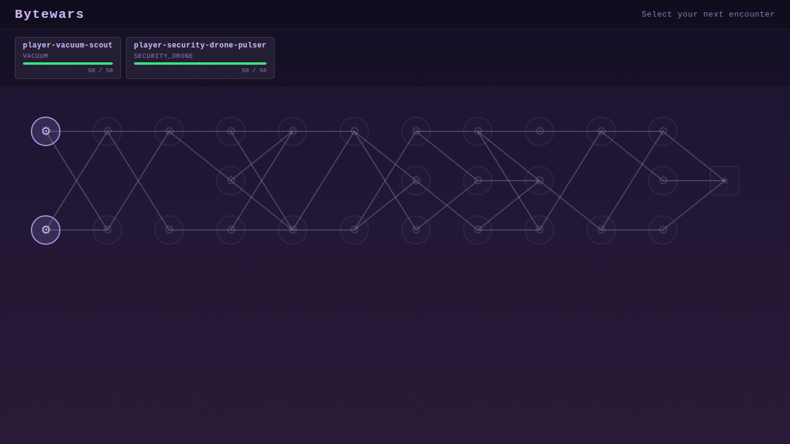

**Gambit editor** — author priority rules for each unit before every fight. Conditions and actions are searchable dropdowns; slots drag to reorder. Each unit tab shows current HP carried from the previous fight.

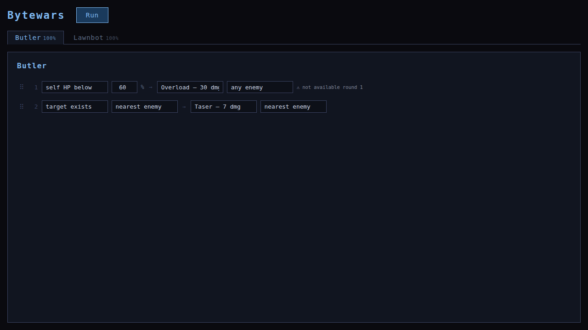

**Combat screen** — fights resolve automatically from your gambit lists. Active unit is highlighted, target indicators animate between attacker and target, a scrolling log tracks every action. Play, pause, step, or fast-forward at 0.5×–10×. Synthesized sound effects and music play in sync.

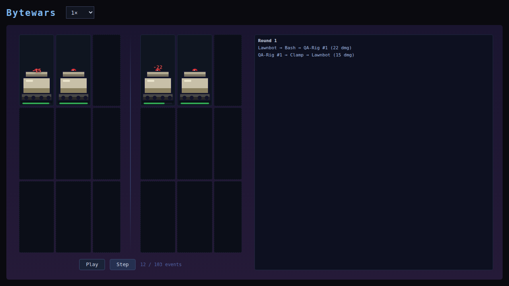

**How to play:**
1. `pnpm install && pnpm dev`
2. Open [http://localhost:5173](http://localhost:5173)
3. The map loads automatically — click a reachable node (⚔) to enter the gambit editor
4. Author rules for each unit, click **Run**
5. Watch the fight play out; when it ends click **Continue →** to return to the map
6. Reach and defeat the boss (★) to win the run — or lose all units and get a game-over

**Squad persistence:** surviving units carry their HP between fights. A unit destroyed in fight N sits out fight N+1 and returns at 42% HP for fight N+2.

**Starter preset pool:** each new run draws 2 random starters at 50 HP / 2 rule slots from `src/content/starter-presets.json`. Edit that file to add, remove, or retune presets.

**Debug pages** (dev server only):
- `/?debug=units` — renders all chassis components side-by-side
- `/?debug=scene` — plays a hand-written fixture through the render layer

<sub>Screenshots and description auto-maintained — run `/refresh-readme` to refresh.</sub>
<!-- CURRENT_STATE:END -->

## Chassis

<!-- CHASSIS:START -->
<table>
  <tr>
    <td>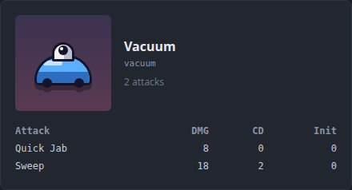</td>
    <td>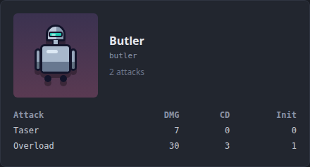</td>
  </tr>
  <tr>
    <td>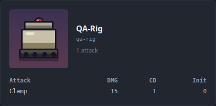</td>
    <td>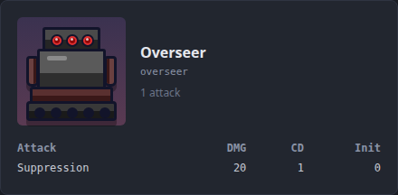</td>
  </tr>
  <tr>
    <td>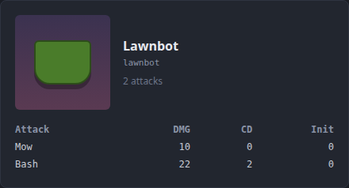</td>
    <td>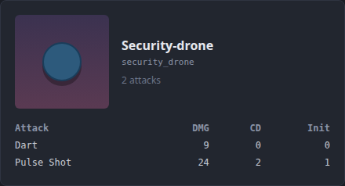</td>
  </tr>
  <tr>
    <td>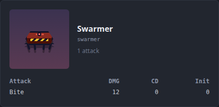</td>
    <td>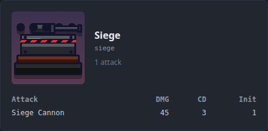</td>
  </tr>
</table>

<sub>Stats are rendered inside each card. Auto-generated — run `/refresh-readme` to refresh.</sub>
<!-- CHASSIS:END -->

## What's Next (v0.5)

- **Named attacks** — replace the generic `attack` action with a roster of chassis-specific named attacks (Quick Jab, Sweep, Taser, Overload, Clamp, Suppression), each with distinct damage values and synthesized sounds
- **Cooldowns** — attacks with higher damage have longer cooldowns; some have an initial warmup before they're available; the gambit interpreter falls through silently to the next rule when an attack is on cooldown
- **Chassis-filtered editor** — the action picker only shows attacks valid for the selected unit's chassis

See `doc/roadmap.md` for the full task breakdown.
