> ❗ This is a fully vibe-coded project and not read by humans. ❗

# Bytewars

A roguelike auto-battler where you program robot squads with gambit-style priority rules, then watch the fights unfold. No manual control — write the plan, commit, watch it execute.

**[Play now →](https://fritzflorian.github.io/bytewarsv2/)**

## Getting Started

```bash
pnpm install
pnpm dev
```

Open [http://localhost:5173](http://localhost:5173) in your browser.

## Scripts

| Command | Description |
|---|---|
| `pnpm dev` | Start development server |
| `pnpm build` | Type-check and build for production |
| `pnpm preview` | Preview production build |
| `pnpm test` | Run unit/integration tests (Vitest, node + jsdom) |
| `pnpm typecheck` | TypeScript type-check without emitting |
| `pnpm e2e` | Run browser tests (Playwright, headless Chromium — auto-starts dev server) |
| `pnpm check` | Full check: `test` + `typecheck` + `e2e` |
| `pnpm lint` | Run ESLint |
| `pnpm pages` | Build and deploy to GitHub Pages (`gh-pages` branch) |

## Current State

<!-- CURRENT_STATE:START -->
The full run loop is playable end-to-end: starter draft → seeded branching map → gambit editor → combat playback → reward pick, looping until you beat the boss or get wiped. Eight chassis ship today and the active/passive **module system** powers the loot economy.

A run begins with a **starter draft** — two sequential 1-of-3 picks from a pool of hand-authored starter presets. Each preset bundles a chassis, pre-installed modules, and opening gambits. After the draft, you land on the map.

**Map screen** — a seeded branching node graph with distinct shapes, colors, and icons per node type: regular **Combat** (⚔), **Elite** (♦, ~2 per map, harder hand-authored fixtures with the elite-only Siege chassis), **Repair Bay** (+, ~1 per map, partial-heal-all on entry, no fight), and **Boss** (★).

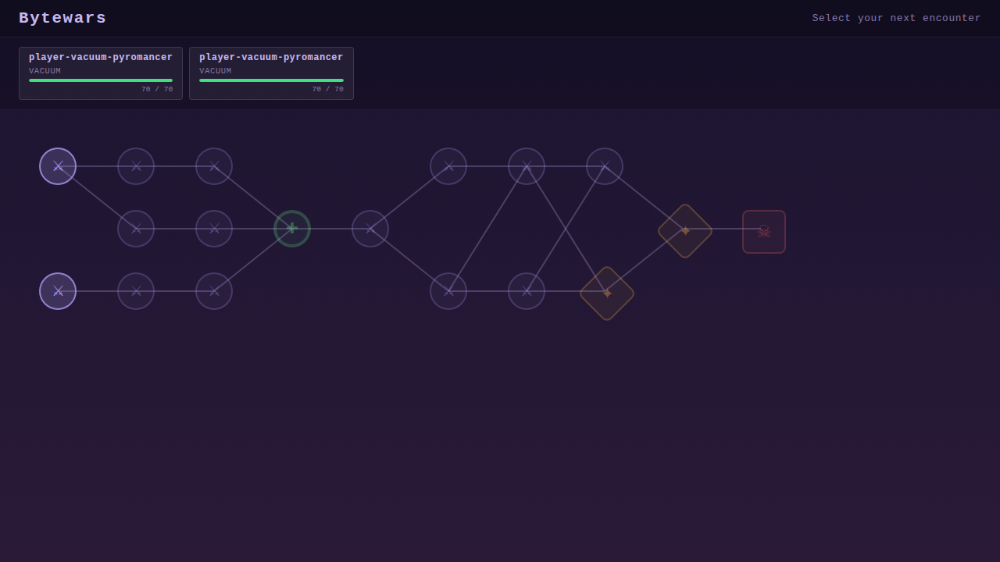

**Gambit editor** — author priority rules for each unit before every fight. The action picker shows only the active modules currently *installed* on the selected unit (with damage, heal amount, and cooldown info); the target picker filters by action kind (enemy targets for attacks, ally targets for heals). A read-only module panel shows each unit's active/passive modules and computed stats (max HP, bonus damage, effective active slots). Rule slots beyond the unit's current cap render as locked placeholders, unlockable via the **+rule-slot** passive module (cap 6).

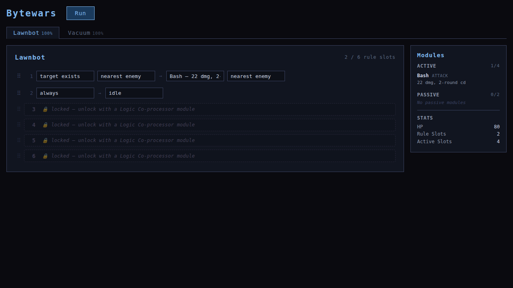

**Combat screen** — fights resolve automatically from your gambit lists. The two sides face each other across a centerline divider, front rows touching it. Each active module produces its own action with synthesized sound; the interpreter falls through silently when a rule's action is on cooldown. Active unit is highlighted, target projectiles animate between attacker and target, a scrolling log tracks every action. Play, pause, step, or fast-forward at 0.5×–10×.

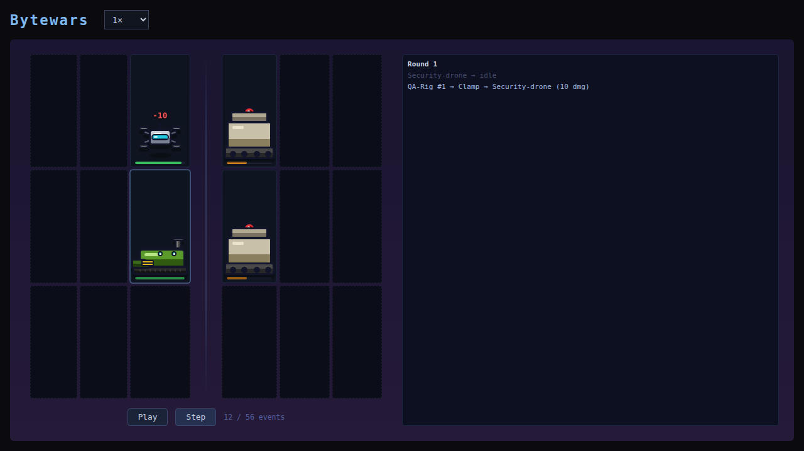

**How to play:**
1. `pnpm install && pnpm dev`
2. Open [http://localhost:5173](http://localhost:5173)
3. Make two starter picks (one preset each round)
4. From the map, click a reachable node — combat/elite nodes open the gambit editor; repair bays heal in place
5. Author rules for each unit, click **Run** and watch the fight
6. After combat, pick one of three rewards (module drop, remove module, new unit, heal one, or heal all) before returning to the map
7. Reach and defeat the boss (★) to win the run — or lose all units and get a game-over

**Squad persistence:** surviving units carry their HP between fights. A unit destroyed in fight N sits out fight N+1 and returns at 42% HP for fight N+2.

**Eight chassis** ship today: four players (**Vacuum**, **Butler**, **Lawnbot**, **Security-drone**) and four enemies (**QA-Rig** in the regular pool, **Overseer** as the boss, **Swarmer** in the regular pool, **Siege** in elite encounters only). See the [Chassis](#chassis) section below for per-chassis base stats.

**Content** is data-driven and Zod-validated at startup. One file per chassis in `src/content/chassis/<id>.json` and one per module in `src/content/modules/<id>.json` (modules are chassis-agnostic — any active module fits any active slot, within the `availability` constraint). Starter and recruitment preset pools live in `src/content/starter-presets.json` and `src/content/recruitment-presets.json`.

**Debug pages** (dev server only):
- `/?debug=units` — renders all chassis components side-by-side
- `/?debug=scene` — plays a hand-written fixture through the render layer
- `/?debug=audio` — synth playground for per-attack sounds and music
- `/?preview=chassis` — chassis overview page used to regenerate the cards below

<sub>Screenshots and description auto-maintained — run `/refresh-readme` to refresh.</sub>
<!-- CURRENT_STATE:END -->

## Chassis

<!-- CHASSIS:START -->
<table>
  <tr>
    <td>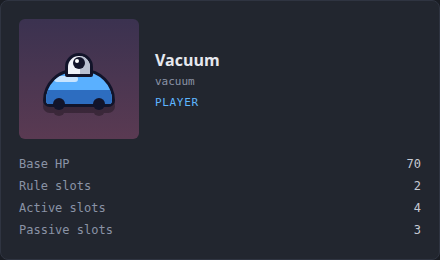</td>
    <td>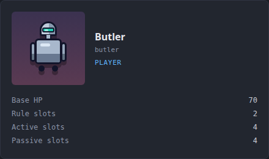</td>
  </tr>
  <tr>
    <td>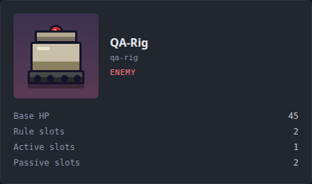</td>
    <td>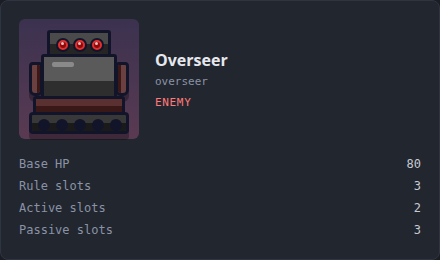</td>
  </tr>
  <tr>
    <td>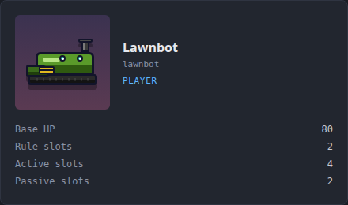</td>
    <td>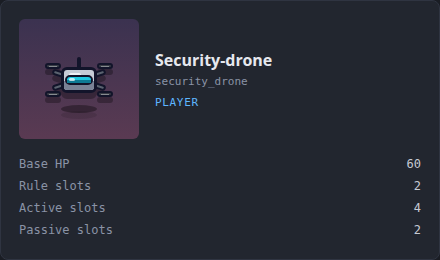</td>
  </tr>
  <tr>
    <td>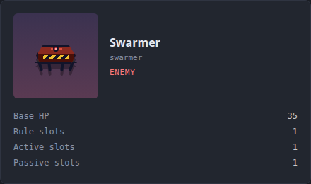</td>
    <td>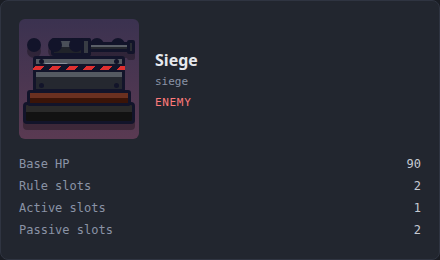</td>
  </tr>
</table>

<sub>Stats are rendered inside each card. Auto-generated — run `/refresh-readme` to refresh.</sub>
<!-- CHASSIS:END -->

## Modules

<!-- MODULES:START -->
### Active modules

Provide one-per-turn combat actions (attacks or heals). Slot into a chassis's active slots; chassis-agnostic. `CD` = cooldown rounds, `Init` = initial cooldown at battle start.

| Name | ID | Kind | Side | Rarity | Effect | CD | Init |
|---|---|---|---|---:|---|---:|---:|
| Bash | `bash` | attack | Both | 2 | 22 dmg | 2 | 0 |
| Bite | `bite` | attack | Enemy | — | 7 dmg | 0 | 0 |
| Clamp | `clamp` | attack | Both | 2 | 10 dmg | 1 | 0 |
| Dart | `dart` | attack | Both | 1 | 9 dmg | 0 | 0 |
| Emergency Repair | `emergency_repair` | heal | Player | 4 | +35 HP | 4 | 1 |
| Mow | `mow` | attack | Both | 1 | 10 dmg | 0 | 0 |
| Overload | `overload` | attack | Both | 3 | 30 dmg | 3 | 1 |
| Patch Kit | `patch_kit` | heal | Player | 2 | +15 HP | 2 | 0 |
| Pulse Shot | `pulse_shot` | attack | Both | 3 | 24 dmg | 2 | 1 |
| Quick Jab | `quick_jab` | attack | Both | 1 | 8 dmg | 0 | 0 |
| Quick Patch | `quick_patch` | heal | Both | 1 | +8 HP | 2 | 0 |
| Siege Cannon | `siege_cannon` | attack | Enemy | — | 30 dmg | 3 | 1 |
| Suppression | `suppression` | attack | Both | 2 | 12 dmg | 2 | 0 |
| Sweep | `sweep` | attack | Both | 2 | 18 dmg | 2 | 0 |
| Taser | `taser` | attack | Both | 1 | 7 dmg | 0 | 0 |

### Passive modules

Always-on effects. Slot into a chassis's passive slots; chassis-agnostic. Duplicate passive modules stack.

| Name | ID | Side | Rarity | Effects |
|---|---|---|---:|---|
| Damage Amplifier | `damage_amplifier` | Both | 2 | +5 damage |
| Expansion Bay | `expansion_bay` | Both | 4 | +1 active slot |
| Heavy Armor | `heavy_armor` | Both | 3 | +30 HP |
| Logic Co-Processor | `logic_co_processor` | Both | 3 | +1 rule slot |
| Overclocked Core | `overclocked_core` | Both | 4 | +10 damage |
| Reinforced Plating | `reinforced_plating` | Both | 1 | +15 HP |

<sub>Auto-generated — run `/refresh-readme` to refresh.</sub>
<!-- MODULES:END -->

## What's Next (v0.8)

- **Status-effect system** — typed effects with magnitude + duration stored on each `UnitInstance`. The new primitive that powers all the v0.8 action variety
- **Action variety** — AoE (row / column / all-enemies), buffs on allies (+damage), debuffs on enemies (disable), and damage-over-time (burning). Attacks can compose status applications via an optional `appliesStatus` clause
- **New module catalog** — ~8–10 hand-authored modules exercising every new action kind, plus a balance pass to land auto-pilot win rate back in the 30–80% band

The v0.8 design kickoff (T-8.1) shipped on 2026-05-10 — see `doc/open-questions.md` Q-V8-1…Q-V8-8 and `doc/gameplay.md` §6 for the locked decisions. See `doc/roadmap.md` for the full v0.8 milestone breakdown.
